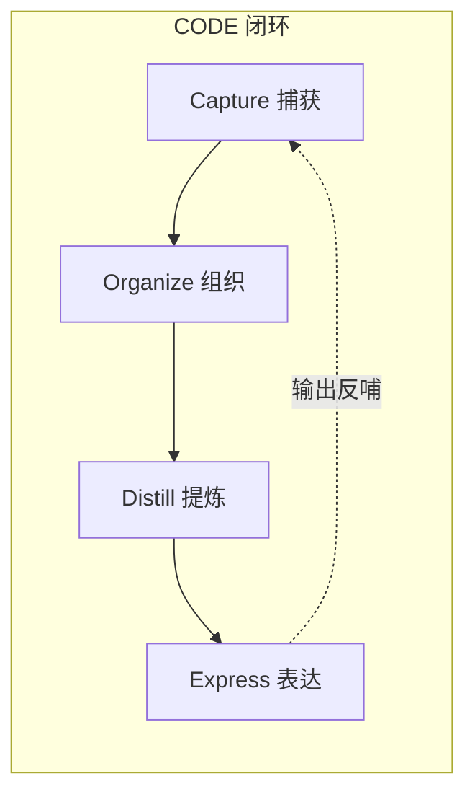
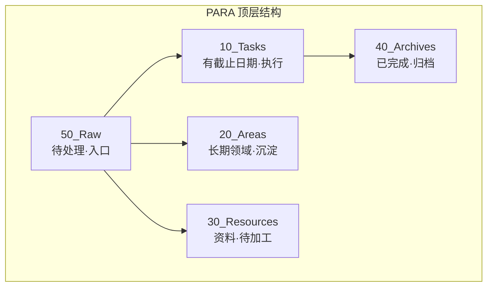
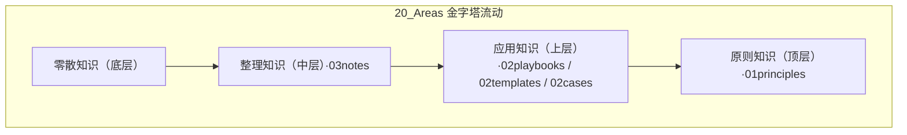
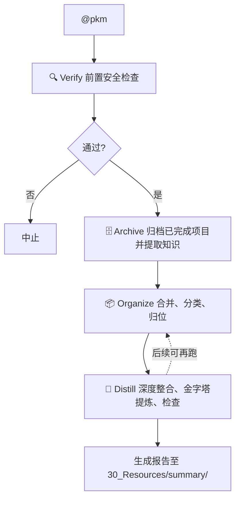
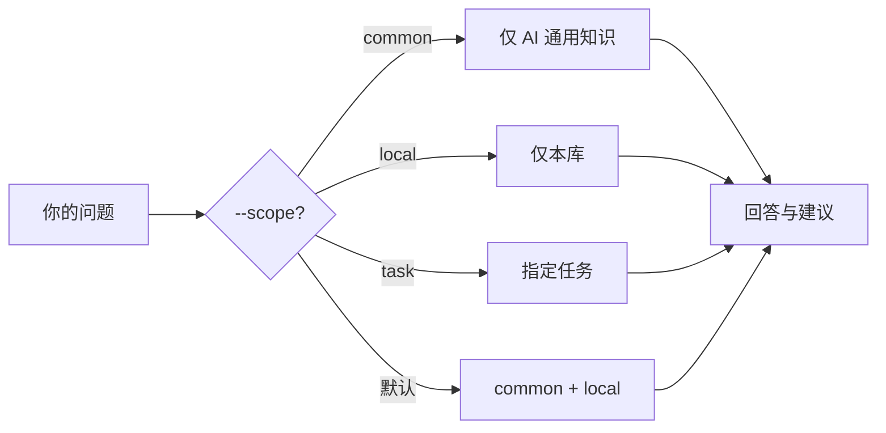
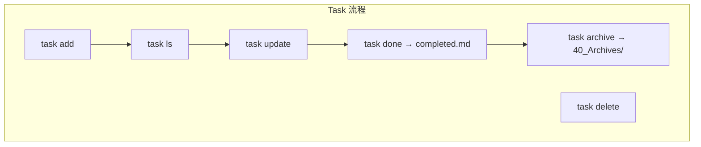
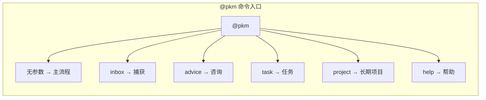

# 知识越记越乱？使用 Skills 实现你的个人知识库（C.O.D.E + PARA）：收集、整理、提炼、暴露

> 本文介绍一套在 **Cursor / Claude Code / Gemini CLI** 下运行的轻量知识管理体系：用「捕获 → 组织 → 提炼 → 表达」闭环 + PARA 结构，把私域知识整理成可被 AI 直接调用的形式，并与 Spec/SDD 等规范类工具互补。文内 Mermaid 图在掘金下可正常渲染。

**本文结构**：一、背景 → 二、工具简介与目标 → 三、核心概念（CODE / PARA / 金字塔）→ 四、目录结构一览 → 五、典型流程（含存量迁移）→ 六、命令速查 → 七、流程与实现模块（进阶）→ 八、上手步骤。文内配有多张 Mermaid 流程图，掘金可正常渲染。

---

## 📋 一、背景

### ⚠️ 1.1 日常痛点与解决思路

**日常常见痛点**：

- **知识碎片化**：随手记下的想法、链接、会议要点散落各处，积累越多越难盘清。
- **整理成本高**：要自己分类、打 tag、建目录，费时费力，往往一拖再拖。
- **用的时候找不到**：真到写方案、做决策时，想不起「以前有过类似经验」，也搜不到。
- **难以沉淀成经验**：碎片始终是碎片，很少有机会被提炼成可复用的流程、模版或原则。
- **任务与知识脱节**：日常待办、项目进展和知识积累各管一摊，事务做完就结束，经验没有自然回流到知识库。

💡 **解决思路**：
本系统面向的正是上述场景——用**轻量命令 + 统一结构**，把「捕获 → 组织 → 提炼 → 表达」串成一条线：你负责思考和决策，系统负责自动整理、归档和沉淀；任务与知识在同一套 PARA 结构里打通，AI 在回答时可以直接调用你的私域知识，而不是只依赖通用语料。

### 🏭 1.2 与工业级方案的关系：不冲突，各有侧重

📐 **传统 SDD / 知识库、Spec-Kit 等方案的侧重**：
强调**流程非常完善、规定非常细致**，以便 AI 严格按规范执行、符合预期、减少出错。文档与流程本身就是「强约束」，解决的是**产出规范与过程管控**。

🏭 **工业级场景**：

- 面对的资料、文档数量级在**几万篇**以上，流程环节多（如 HPPD 多阶段）、**跨部门、跨代码库**。
- 需要在「知识沉淀」和「知识输出」上做**专门设计与建设**。
- 现有做法包括 SDD（结构化的设计与开发规范）、知识工程、以及 Spec-Kit、SDD 等工具链，搭建与使用都需要遵循既定流程，成本相对较高。

本系统与上述方案**并不冲突**：Spec、SDD 等负责「如何写好规范、让开发按规范走」；本系统的核心是**整理私域知识**——把个人或团队的碎片经验收敛成可检索、可被 AI 调用的知识库。一个管「产出规范」，一个管「知识原料」，可以同时使用。

💡 **本系统的定位**：
**核心是整理私域知识**。日常最常用的场景往往是：

- 文档与笔记体量在**百篇量级**，维护的模块或主题节点有限。
- 需求不是「从零生成一整套工业级产出」，而是：**在已有经验的基础上，把私域知识整理好，让 AI 帮着作答、给建议、做补充**。
- 用户需要**持续积累和整理知识**，又希望流程轻、能日常坚持。

因此，本系统做**轻量方案**：专注「自整理、自清洁、自进化」和**为 AI 提供整理好的私域知识**，低门槛、可日常使用，与 Spec/SDD 等规范类工具互补而非替代。

🔮 **未来**：
随着 AI 能力持续进化，你持续整理进本系统的私域知识会一直更新、始终是「最新鲜」的那一批，用好自己的知识，在日常场景下往往就够用。

---

## 🎯 二、工具简介与目标

在**整理私域知识**这一核心上，本系统用 **Cursor/Claude Code/Gemini CLI + Git + PARA + CODE** 实现「捕获 → 组织 → 提炼 → 表达」的完整闭环，统一入口为 `@pkm` 命令。为与 Cursor、Claude Code、Gemini CLI 等**强 agent 环境**深度结合，本系统采用 **Skill** 形态实现：各流程以 Skill 文件承载提示与规则，由 agent 直接加载、解析并执行，你通过一句 `@pkm` 即可驱动整套能力，无需额外插件或中间层。

🎯 **三大目标**：

1. 🧹 **自整理、自清洁、自进化**
   系统自动完成归档、合并、分类、提炼，知识按金字塔从零散沉淀到原则，无需你反复动手整理；随使用持续更新，越用越有序。
2. 📋 **管理日常任务，自行记忆与总结**
   用 task 与项目结构管理待办和进行中的事；AI 帮你做记忆（落在 inbox/notes）、做总结（Distill 报告、完成复盘），你只需做决策和纠偏。
3. 🤖 **为 AI 提供私域知识**
   你的笔记、项目、领域知识统一落在 PARA 结构中，通过 `@pkm advice` 等能力被检索与调用，让 AI 在回答和建议时基于**你的私域知识**，而不是仅用通用语料。

👥 **适合谁用**：
若你符合第一章描述的场景（有碎片难整理、用时会找不到、希望事务与知识打通、并让 AI 用上自己的知识），本系统即面向你——个人或小团队、想轻量整理私域知识并供 AI 调用者均可使用。

---

## 🧩 三、核心概念

### ⚖️ 3.1 设计原则

- ⚡ **简单至上**：流程和操作尽量少，核心机制简单好记。
- 🤖 **相信 AI**：判断和分类交给 AI，你主要负责后期纠偏，保证自动化可执行。
- 📈 **渐进提炼**：从碎片到知识、从知识到经验，是一步步提炼出来的，而不是一步到位。

### 🔄 3.2 CODE 信息管理法则

CODE 描述的是「从收集到输出」的完整闭环：

- 📥 **Capture（捕获）**：把碎片信息快速丢进 `50_Raw/inbox/`，降低记录门槛。
- 📦 **Organize（组织）**：按主题合并、按类型拆分，再归到对应位置（项目 / 领域 / 资源）。
- 💎 **Distill（提炼）**：在领域内做去重、关联、结构化，并按「金字塔」往上沉淀。
- 💬 **Express（表达）**：通过咨询、复盘、归档等方式，把沉淀下来的知识用起来。



### 📁 3.3 PARA 结构

PARA 解决「东西放在哪」的顶层划分：

- 🏗️ **10_Tasks（项目）**：有明确截止日期的任务，偏执行。
- 🧠 **20_Areas（领域）**：长期负责的方向，偏知识沉淀。
- 📚 **30_Resources（资源）**：感兴趣但还没深加工的素材，如文档、链接。
- 🗄️ **40_Archives（归档）**：已完成的项目、已不活跃的领域，只保留不常动。
- 📥 **50_Raw（素材区）**：统一的「待处理入口」，含 inbox 和未分类碎片，整理完应清空。



### 🔺 3.4 金字塔流动（20_Areas 内部）

在 20_Areas 里，知识按「从零散到凝练」自下而上流动：

- 📄 **底层（零散知识）**：未整理的、碎片的、刚收进来的内容。
- 📑 **中层（整理知识）**：按领域整理过的知识集合，主要在 `03notes/`。
- 📋 **上层（应用知识）**：Playbooks（标准化流程）、Templates（模版）、Cases（案例），在 `02playbooks/`、`02templates/`、`02cases/`。
- 🎯 **顶层（原则知识）**：方法论、原则、框架，在 `01principles/`。

流动方向：零散 → 整理 → 应用 → 原则，通过 Distill 一步步提炼。



---

## 📂 四、目录结构一览

整体物理结构如下，只要记住「五块 + 一个入口」即可。

```text
.
├── 🏗️ 10_Tasks/               # 【P】活跃任务（聚焦任务执行）
│   ├── tasks.md                 # 任务清单索引（四象限）
│   ├── tasks_archive.md         # 已完成任务清单
│   ├── TASK_WORKSPACE_YYYYMMDD_HHMMSS_XXX/   # 任务工作区（时间戳_XXX 格式）
│   │   └── task.md              # 任务详细数据；完成后生成 completed.md
│   └── ...
│
├── 🧠 20_Areas/                  # 【A】长期领域（聚焦知识沉淀，按金字塔流动）
│   ├── Projects/                # 长期项目（@pkm project 管理）
│   ├── manual/                  # 受保护区：全域共用素材区（AI 只读，人工按需删除/更新）
│   └── knowledge/               # 知识区
│       ├── 01principles/        # 顶层原则层：方法论、原则、框架
│       ├── 02playbooks/         # 上层应用层：标准化流程（SOP、操作手册）
│       ├── 02templates/         # 上层应用层：可复用的模版和格式
│       ├── 02cases/             # 上层应用层：具体案例和实例
│       └── 03notes/             # 中层整理知识：按领域分类
│           ├── 01_python/       # Python 领域知识
│           ├── 02_算法设计/      # 算法设计领域知识
│           └── ...              # 其他领域知识
│
├── 📚 30_Resources/              # 【R】原材料（聚焦第三方资料与文档）
│   ├── Library/                 # 静态资料库（PDF、电子书、参考文档）
│   └── summary/                 # 提炼报告输出目录
│
├── 🗄️ 40_Archives/               # 【A】归档区
│   ├── TASK_WORKSPACE_YYYYMMDD_HHMMSS_XXX/   # 归档任务工作区（保留完整结构）
│   └── ...
│
└── 📥 50_Raw/                    # 【Raw】统一素材区（整理后应清空）
    ├── inbox/                   # 捕获的原子笔记（@pkm inbox 产出）
    ├── merged/                  # 合并后的素材（Organize 产出，待分类）
    └── ...                      # 其他待分类素材（Archive 回流、临时文件等）
```

**简要说明**：

- 🏗️ **10_Tasks**：`tasks.md` 为任务清单索引，`tasks_archive.md` 为已完成任务；每个任务有独立工作区 `TASK_WORKSPACE_*/`，内设 `task.md`，完成后生成 `completed.md`。
- 🧠 **20_Areas**：`manual/` 共用；`knowledge/` 下 `01principles/`、`02playbooks/`、`02templates/`、`02cases/`、`03notes/<领域>/` 对应金字塔各层；`Projects/` 为长期项目。
- 📚 **30_Resources**：`Library/` 放资料，`summary/` 放提炼报告。
- 🗄️ **40_Archives**：归档已完成任务的工作区目录，结构原样保留。
- 📥 **50_Raw**：`inbox/` 是捕获落点，`merged/` 是合并后、待分类的中间结果，整理完会清空。

---

## 🚀 五、你会怎么用 — 典型流程

### 🔄 5.1 主流程总览

最常用的是「主流程」：执行一次就会依次做「安全检查 → 归档 → 组织 → 提炼」。



### 📥 5.2 捕获流程（Capture）

**命令**：`@pkm inbox <内容>`

**作用**：把一句话、一条链接、一段想法，变成一条原子笔记，落到 `50_Raw/inbox/`。

**大致步骤**：

1. 你输入内容（文字或链接）。
2. 若内容像「任务」（有动词、时间、目标），会建议改用 `@pkm task`。
3. 若不是任务，AI 做简短总结并生成 5～10 字标题。
4. 链接默认当引用；加 `--online` 可抓取网页内容。
5. 保存为：`50_Raw/inbox/YYYYMMDD_HHMMSS_标题_inbox.md`。

**效果**：想到就记，不纠结路径和命名。

### 💎 5.3 提炼主流程（Verify → Archive → Organize → Distill）

**命令**：`@pkm`（无参数即跑主流程）

🔍 **Verify（前置安全检查）**：

- 检查 5 个顶级目录（10_Tasks、20_Areas、30_Resources、40_Archives、50_Raw）是否存在、结构是否完整。
- 限定操作范围在白名单内；`manual/` 只读。
- 任一检查失败则中止，不执行后续步骤。

🗄️ **Archive（归档与回流）**：

- 扫描 `10_Tasks/` 下所有任务工作区，找出带 `completed.md` 的（表示已完成）。
- 按 `completed.md` 抽取可复用知识 → `20_Areas/knowledge/`、`20_Areas/Projects/<项目名>/`。
- 将任务工作区目录移至 `40_Archives/`，保留完整结构。

📦 **Organize（组织分类）**：

- 扫描 `50_Raw/`（含 inbox 及其他待分类文件）。
- 按主题/类型合并到 `50_Raw/merged/`。
- 判断是「项目/知识/资料」并归位：
  - 项目相关 → `20_Areas/Projects/<项目名称>/`
  - 知识 → `20_Areas/knowledge/03notes/<领域>/`
  - 资料 → `30_Resources/Library/`
- 归位完成后清空 `50_Raw/`。

💎 **Distill（提炼沉淀）**：

- 只处理 `20_Areas/03notes/` 中的新增或变更。
- 与已有内容做去重、交叉引用、结构化。
- 按金字塔：notes（及 areas 的 manual，只读参考）→ 整理知识 → playbooks/templates/cases → principles。
- 做一致性、过期、冗余、逻辑等检查。
- 输出提炼报告到 `30_Resources/summary/YYYYMMDD_HHMMSS_标题_Distill.md`。

### 💬 5.4 Express 流程（咨询 / 输出）

**命令**：`@pkm advice <问题> [--scope <范围>]`

**作用**：基于知识库（和可选 AI 通用知识）回答你的问题，并可能给出「这条笔记更适合放哪个目录」等建议。

**流程概览**：

1. 按 `--scope` 确定检索范围。
2. 在对应范围里检索内容。
3. 结合检索结果与 AI 知识生成回答。

**scope 含义**：

- `common`：只用 AI 通用知识。
- `local`：只查当前知识库（10_Tasks、20_Areas、30_Resources、40_Archives）。
- `task`：只查指定任务知识库。
- 不写时默认：common + local。



### ✅ 5.5 任务与长期项目（扩展流程）

**命令**：`@pkm task [操作] [参数]`

**常用操作**：

- `@pkm task add <内容>`：添加任务（可交互补全：想法、四象限、计划、实现思路、关联项目）；自动创建任务工作区与 task.md，并写入 tasks.md 索引。
- `@pkm task ls`：按四象限列出任务，支持 `ls --all` 含已归档；含进展核查与延期风险提示。
- `@pkm task update <id>`：更新进展（会记录日期和一句话进展）。
- `@pkm task done <id>`：标记完成（会问总结、收益、价值评分，生成 completed.md，并写入 tasks_archive.md）。
- `@pkm task archive`：自动扫描所有含 completed.md 的任务工作区，回流知识到 20_Areas，并将工作区移至 40_Archives/。
- `@pkm task delete <id>`：删除任务。

**四象限**：重要且紧急 / 重要不紧急 / 不重要但紧急 / 不重要不紧急，用于排序和取舍。

**长期项目**：`@pkm project add <名称>` — 在 `20_Areas/Projects/` 下创建长期项目目录，任务可关联到项目。



### 📦 5.6 存量知识的迁移

已有笔记、文档、导出内容想纳入本系统时，**先把知识放到 `50_Raw/` 里**（可放进 `inbox/` 或直接在 `50_Raw/` 下建子目录按批堆放）。放好后执行一次主流程 `@pkm`，系统会按既有逻辑做 Organize（合并、分类、归位）和 Distill（去重、关联、金字塔提炼）。无需单独「导入」命令，统一走 Raw → 主流程即可完成迁移与整理。

---

## ⌨️ 六、命令速查

所有入口都是 `@pkm`，通过子命令区分用途。

| 场景             | 命令                                                 | 说明                                              |
| ---------------- | ---------------------------------------------------- | ------------------------------------------------- |
| 记一条想法/链接  | `@pkm inbox <内容>`                                | 写入 50_Raw/inbox/，可加 `--online` 抓网页      |
| 做一次完整整理   | `@pkm`                                             | 顺序执行 Verify → Archive → Organize → Distill |
| 基于知识库问答   | `@pkm advice <问题> [--scope common\|local\|task]`   | 不写 scope 时用 common+local                      |
| 添加任务         | `@pkm task add <内容>`                             | 可交互补全四象限、计划等，写入 tasks.md 索引      |
| 看所有任务       | `@pkm task ls`                                     | 按四象限展示，`ls --all` 含已归档；含进展核查与延期风险提示 |
| 更新/完成/删任务 | `@pkm task update/done/delete <id>`                 | done 生成 completed.md 并写入 tasks_archive.md   |
| 归档已完成任务   | `@pkm task archive`                                | 自动扫描含 completed.md 的工作区，回流知识并移至 40_Archives/ |
| 添加长期项目     | `@pkm project add <名称>`                          | 在 20_Areas/Projects/ 下创建                     |
| 查看帮助         | `@pkm help`                                        | 显示命令与用法                                    |



---

## 🔧 七、流程与实现模块对应（进阶）

若要理解「每个流程是谁在干活」，可对应到 `.pkm/Skills/PKM/` 下的 Skill 文件：

| 你用的命令/动作     | 对应的 Skill 文件      | 主要职责                                  |
| ------------------- | ---------------------- | ----------------------------------------- |
| 任意操作前          | `_Verifier.md`       | 检查目录、缺失则自动创建，范围与 manual 只读 |
| `@pkm inbox`      | `_Inbox.md`          | 生成原子笔记到 50_Raw/inbox/              |
| `@pkm` 主流程     | `_TaskManager.md`（task archive） | 归档已完成任务，回流知识到 20_Areas       |
| `@pkm` 主流程     | `_Organizer.md`      | 合并、分类、归位，清空 50_Raw             |
| `@pkm` 主流程     | `_Distiller.md`      | 整合、金字塔提炼、检查、写报告            |
| `@pkm advice`     | `_Advisor.md`        | 按 scope 检索并回答                       |
| `@pkm project add` | `_ProjectManager.md` | 在 20_Areas/Projects/ 下创建长期项目       |
| `@pkm task`        | `_TaskManager.md`    | 维护 tasks.md / tasks_archive.md、任务工作区与 task.md、四象限 |

**设计要点**：单一职责、统一从 `SKILL.md` 路由、先 Verify 再执行、主流程 = Verify → Archive → Organize → Distill 的组合，和「相信 AI、渐进提炼」一致。

**当前局限与优化思路**：本系统是一个**通用框架**，优势是适配面广，缺点是相对泛化，可从两方面理解并做增强：

1. **整理的泛化**：知识统一按「零散 → 整理 → 应用 → 原则」的通用金字塔逻辑提炼，不针对某领域做特殊结构。若某个领域（如合规、算法、运维）有固定分类或模板，**可在对应 Skill 的提示词中写明该领域的结构要求**，Distill 时会按你的约定做归类与存放，从而在通用底座上实现领域定制。
2. **输出的泛化**：本系统默认以「提供私域知识、回答与建议」为主，不负责生成严格流程或规范文档。若你需要**具体流程、规格或步骤**，可以把本系统当作 **RAG 知识源**，由下游的 workflow 引擎或 Spec-Kit 等工具调用——本系统负责「整理好、可检索的私域知识」，流程与格式由上游工作流或 Spec 工具承接。

---

## ✨ 八、上手步骤

1. 📥 用 `@pkm inbox` 随便记几条想法或链接，确认 `50_Raw/inbox/` 里能看到文件。
2. 🔄 跑一次 `@pkm`，看 Verify → Archive → Organize → Distill 的日志或结果，并到 `30_Resources/summary/` 看是否生成了 Distill 报告。
3. 💬 用 `@pkm advice` 问一个和现有笔记相关的问题，试一下不加 scope 和加 `--scope local` 的差别。
4. ✅ 用 `@pkm task add` 建一两条任务，再用 `@pkm task ls` 和 `@pkm task done` 走一遍完成，最后用 `@pkm task archive` 或主流程 `@pkm` 归档。

完成以上后，你就已经走通了「捕获 → 整理 → 咨询 → 任务」的完整链路，后续可以按需多练 inbox + 主流程，再逐步用 advice 和 task 配合自己的工作节奏。

---

**延伸与链接**

- **项目地址**：https://github.com/EvilJoker/pkmskill
- **进一步阅读**：更完整的目录约定、工作流与命令设计见仓库内 `docs/ARCHITECTURE.md`；Skill 文件位于 `.pkm/Skills/PKM/`，可按需在提示词中做领域定制。
